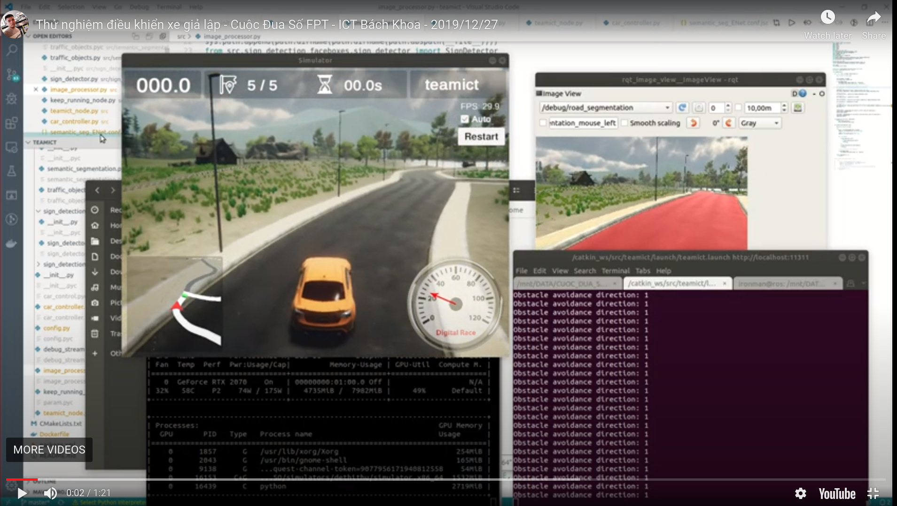

# Autonomous car - FPT Digital Race (Cuộc Đua Số) 2020

This is the source code for round 1 - simulation car.

- Repository for car system: <https://github.com/vietanhdev/autonomous-car-2020>.
- Repository for road segmentation: <https://github.com/vietanhdev/autonomous-car-2020-road-seg>.
- Repository for traffic sign detection: <https://github.com/vietanhdev/autonomous-car-2020-sign-detection>.

## Demonstration video

<a href="https://youtu.be/SP6ipnIiAO0" target="_blank">
    
</a>

## I. Project Info:

- Team name: teamict

## II. Environment Setup

- Ubuntu 18.04
- Miniconda or Anaconda
- OpenCV 3.4.3: <scripts/install_opencv_3.sh>

### 4. Robot Operating System
  
- Install ROS Melodic - full desktop version: <http://wiki.ros.org/melodic/Installation/Ubuntu>
  
### 5. Initialize Catkin workspace

We need to initialize catkin workspace at the first time (build folders for projects).

```terminal
cd main_ws
catkin_make
```

Add workspace to PATH:

```terminal
echo "source !(pwd)/main_ws/devel/setup.bash" >> ~/.bashrc
source ~/.bashrc
```

### 6. Create Conda environment 

```terminal
cd main_ws
conda env create -n cds -f environment.yml 
conda activate cds
```
  
### 7. Dependencies: 

- rosbridge-suite

```terminal
sudo apt-get install ros-melodic-rosbridge-server
```

## III. Build and Run

### Step 1. Build project

```
cd  main_ws
catkin_make
```

## Step 2. Run ROS server and services

**NOTE:** Don't use conda environment here!!!

```
roslaunch teamict server.launch
```

## Step 3. Run the simulator

Enter Team name: `teamict` and server address: `ws://localhost:9090`.

## Step 4. Run car controller

Open another Terminal and type:

```
conda activate cds
roslaunch teamict teamict.launch
```

OR

```
conda activate cds
rosrun teamict teamict_node.py
```

## Step 5. Launch debug image viewer

Because we could not use `cv2.imshow()` to show image in this environment, <main_ws/src/teamict/src/debug_stream.py> is developed to view debug images.

Please use this command to open debug image viewer:

```
rosrun rqt_image_view rqt_image_view
```

## Folder structure and debugging

### Code structure

- Source code for running car (we will mainly work here): <main_ws/src/teamict/src>.
- In that folder:
    + teamict_node.py: main node file
    + config.py: configuration file
    + debug_stream.py: stream of debug images. Please see the usage in teamict_node.py
    + image_processor.py: where to receive images and process.

### How to publish debug images?

- Pass `debug_stream` instance created in `teamict_node.py` to any class you want to debug.
- Create a stream for image using: `debug_stream.create_stream('<stream_name>', '<topic_path>')`

```
debug_stream.create_stream('depth', 'debug/depth')
```

- Publish image: `debug_stream.update_image('<stream_name>', <image>)`

```
debug_stream.update_image('depth', depth_image)
```

- Open debug image viewer:

```
rosrun rqt_image_view rqt_image_view
```


### Record video

### Step 1: Record images

```
mkdir video_rgb
cd video_rgb
rosrun image_view image_saver image:=/teamict/camera/rgb _image_transport:=compressed
```

```
mkdir video_depth
cd video_depth
rosrun image_view image_saver image:=/teamict/camera/depth _image_transport:=compressed
```

### Step 2: Convert to videos

In `video_rgb`:

```
ffmpeg -framerate 25 -i left%04d.jpg -c:v libx264 -profile:v high -crf 20 -pix_fmt yuv420p 01_rgb.mp4
```

In `video_depth`:

```
ffmpeg -framerate 25 -i left%04d.jpg -c:v libx264 -profile:v high -crf 20 -pix_fmt yuv420p 01_depth.mp4
```

## BUGS:

- https://answers.ros.org/question/220502/image-subscriber-lag-despite-queue-1/
